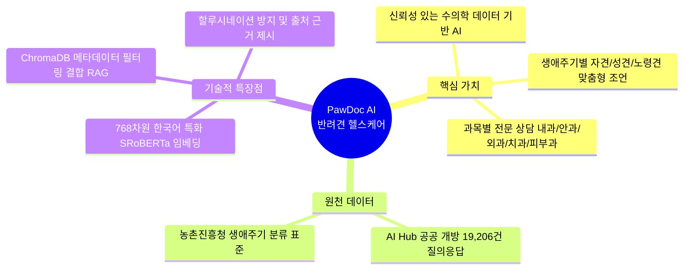
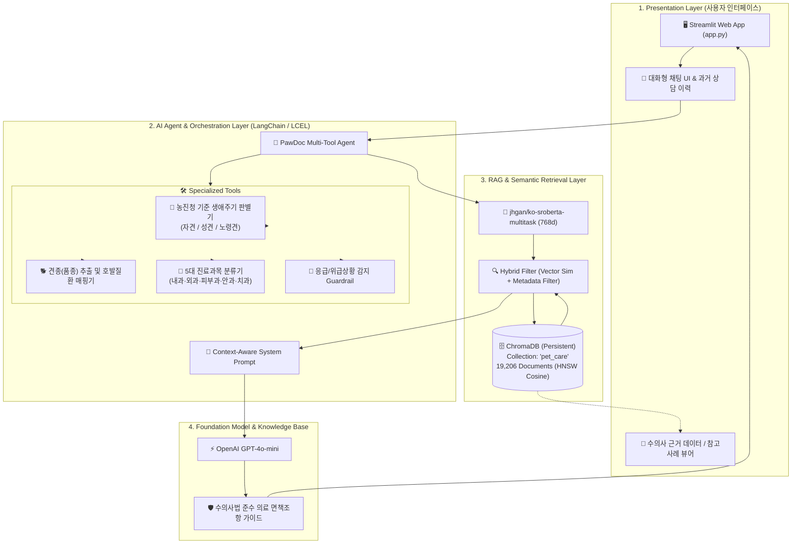
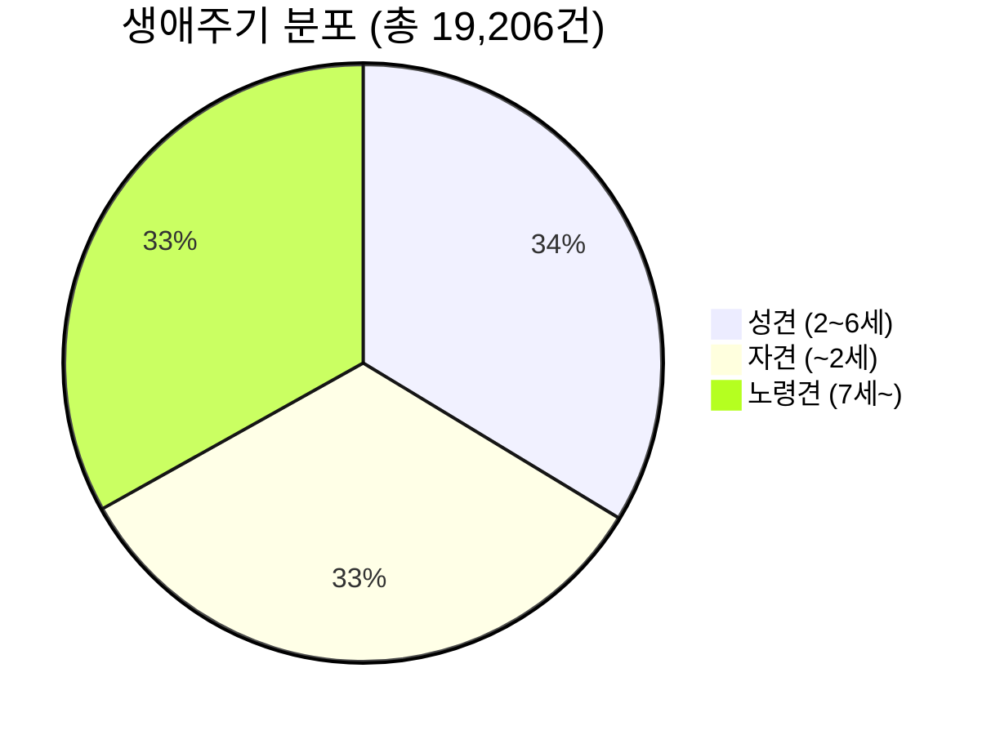
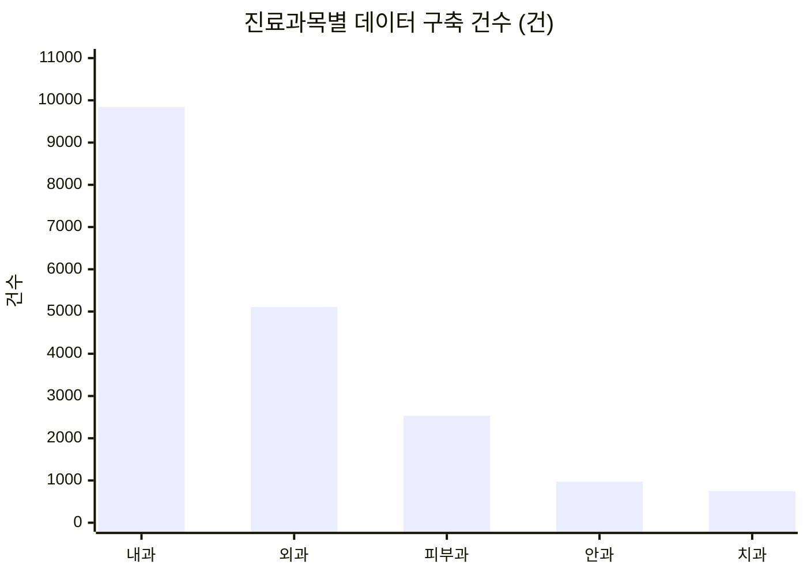
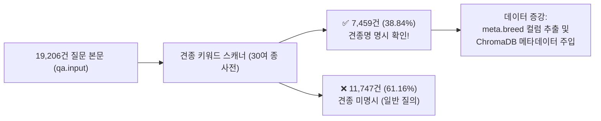
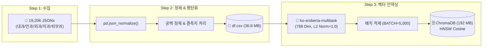
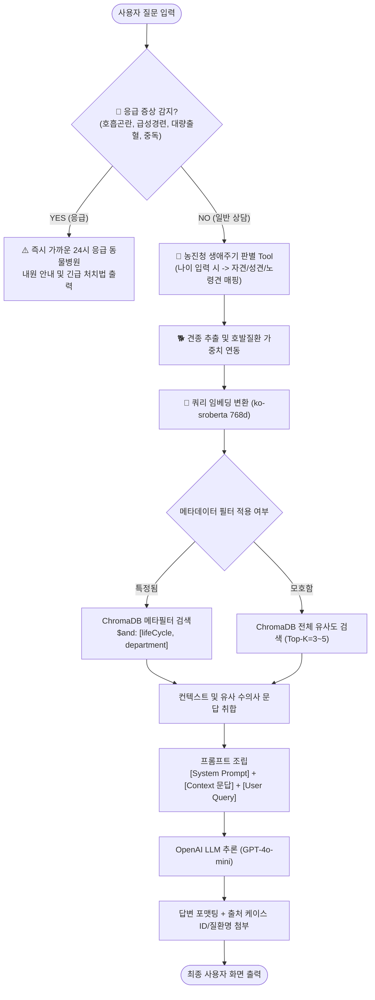
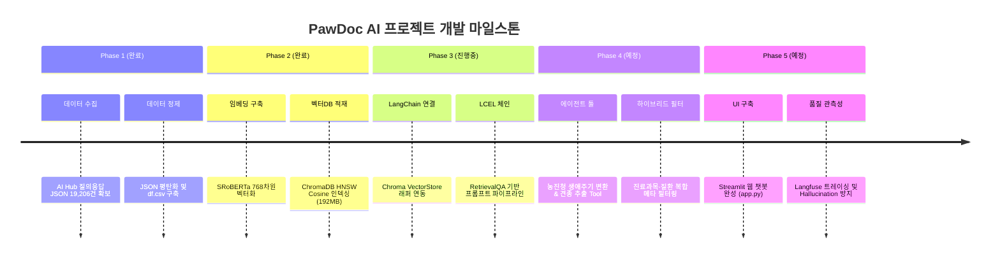

# 🐾 [프로젝트 종합 분석 보고서] 반려견 맞춤형 건강 관리 AI 챗봇 시스템 (PawDoc AI)

> **문서 버전**: v2.0<br>
> **기준 일자**: 2026-08-19<br>
> **프로젝트 팀**: 백관민, 오현탁, 봉기람 ([Notion 워크스페이스](https://app.notion.com/p/3b5fceb573c380ea8488c7936f77f6d5))<br>
> **데이터 원천**: [AI Hub 반려견 성장 및 질병관련 말뭉치 데이터 (No. 71879)](https://aihub.or.kr/aihubdata/data/view.do?dataSetSn=71879)

---

## 1. 프로젝트 개요 & 서비스 콘셉트 (Concept & Vision)



| 구분 | 프로젝트 핵심 명세 |
| :--- | :--- |
| **서비스 명칭 (가칭)** | **PawDoc AI (반려견 생애주기별 맞춤 건강 어드바이저)** |
| **핵심 목적** | 보호자의 자연어 증상 질문에 대해 **1.9만 건의 전문 수의학 질의응답 데이터**를 기반으로 진료과목 분류, 응급도 안내, 생애주기/견종별 맞춤 관리법 및 출처 근거를 제시하는 RAG 챗봇 |
| **핵심 기술 스택** | Python 3.12, LangChain, ChromaDB, HuggingFace (`jhgan/ko-sroberta-multitask`), OpenAI (GPT-4o-mini), Streamlit |

---

## 2. 종합 시스템 아키텍처 (System Block Diagram)



---

## 3. 데이터셋 정밀 전수 분석 (Data Deep-Dive)

### 3.1 생애주기 및 진료과목 교차 분포 (Cross-Tabulation)





| 진료과목 | 노령견 (7세~) | 성견 (2~6세) | 자견 (~2세) | 합계 (건) | 비중 (%) |
| :--- | :---: | :---: | :---: | :---: | :---: |
| **내과** | 3,271 | 3,268 | 3,307 | **9,846** | **51.3%** |
| **외과** | 1,686 | 1,738 | 1,683 | **5,107** | **26.6%** |
| **피부과** | 832 | 877 | 824 | **2,533** | **13.2%** |
| **안과** | 313 | 358 | 299 | **970** | **5.0%** |
| **치과** | 258 | 227 | 265 | **750** | **3.9%** |
| **전체 합계** | **6,360 (33.1%)** | **6,468 (33.7%)** | **6,378 (33.2%)** | **19,206** | **100.0%** |

---

### 3.2 전체 등록 질병(`meta.disease`) 전수 통계

데이터셋에 존재하는 44종 질환(총 19,206건)의 전체 분포입니다:

| 순위 | 질병명 | 건수 (건) | 점유율 (%) | 연관 진료과 |
| :---: | :--- | :---: | :---: | :---: |
| **-** | **기타 (일반 건강/복합 증상)** | **14,774** | **76.92%** | 전 과목 공통 |
| **1** | **중성화수술** | **579** | **3.01%** | 외과 |
| **2** | **무릎뼈 탈구 (슬개골 탈구)** | **529** *(517+12)* | **2.75%** | 외과 |
| **3** | **중독 (식이/약물 등)** | **414** | **2.16%** | 내과 |
| **4** | **골절** | **364** | **1.90%** | 외과 |
| **5** | **심장사상충** | **352** | **1.83%** | 내과 |
| **6** | **자궁축농증** | **329** | **1.71%** | 외과 / 내과 |
| **7** | **외이염** | **288** | **1.50%** | 피부과 |
| **8** | **위장관폐색** | **228** | **1.19%** | 외과 / 내과 |
| **9** | **아토피성 피부염** | **224** | **1.17%** | 피부과 |
| **10** | **방광염** | **200** | **1.04%** | 내과 |
| **11** | **결막염** | **134** | **0.70%** | 안과 |
| **12** | **부신피질기능항진증 (쿠싱)** | **117** | **0.61%** | 내과 |
| **13** | **제3안검탈출증 (체리아이)** | **96** | **0.50%** | 안과 |
| **14** | **방광결석 / 유루증(눈물흘림)** | **각 81** | **0.42%** | 비뇨기 / 안과 |
| **16** | **급성신부전** | **68** | **0.35%** | 내과 |
| **17** | **전방십자인대파열** | **67** | **0.35%** | 외과 |
| **18** | **녹내장** | **49** | **0.25%** | 안과 |
| **19** | **치은염** | **44** | **0.23%** | 치과 |
| **20** | **복막염 / 혈소판감소증** | **30 / 29** | **0.15%** | 내과 |
| **22** | **단두종증후군 / 추간판질환(디스크)** | **22 / 20** | **0.11%** | 호흡기 / 외과 |
| **24** | **유선종양 / 치근단농양 / 건성각결막염** | **13 / 10 / 10** | **0.06%** | 외과 / 치과 / 안과 |
| **27** | **췌장염 / 담낭정액낭종 / 만성신부전** | **9 / 9 / 8** | **0.05%** | 내과 |
| **30** | **피부사상균증 / 백내장** | **7 / 4** | **0.03%** | 피부과 / 안과 |
| **32** | **빈혈 / 항문낭염 / 저혈당 / 기관지염 / 흉수** | **각 2** | **0.01%** | 내과 / 피부과 |
| **37** | **폐렴 / 위장관출혈 / 식도이물 / 각막궤양 / 장내이물 / 고관절이형증** | **각 1** | **< 0.01%** | 내과 / 외과 / 안과 |

---

### 3.3 견종(품종) 구분 가능 여부 분석 결과



| 순위 | 품종명 | 본문 언급 건수 | 비중 (%) | 주요 호발 질환 (유전/다빈도) |
| :---: | :--- | :---: | :---: | :--- |
| **1** | **말티즈** | **1,905건** | **9.92%** | 무릎뼈(슬개골) 탈구, 유루증(눈물착색), 심장판막질환 |
| **2** | **푸들** | **1,333건** | **6.94%** | 슬개골 탈구, 백내장, 쿠싱증후군, 외이염 |
| **3** | **포메라니안 / 포메** | **927건** | **4.83%** | 슬개골 탈구, 기관지협착증, 피부탈모 |
| **4** | **비숑 / 비숑프리제** | **493건** | **2.57%** | 알레르기성 피부염, 방광결석, 슬개골 탈구 |
| **5** | **믹스견** | **474건** | **2.47%** | 일반/복합 내과 질환 |
| **6** | **시츄 / 시추** | **351건** | **1.83%** | 결막염, 각막궤양, 안구건조증, 피부염 |
| **7** | **치와와** | **230건** | **1.20%** | 저혈당, 슬개골 탈구, 심장질환 |
| **8** | **리트리버 (골든/래브라도)** | **192건** | **1.00%** | 고관절이형증, 십자인대파열, 대형견 종양 |
| **9** | **진돗개** | **186건** | **0.97%** | 피부사상균증, 알레르기, 소화기 질환 |
| **10** | **닥스훈트** | **147건** | **0.77%** | 추간판질환 (디스크), 관절염 |
| **11** | **요크셔테리어 (요키)** | **139건** | **0.72%** | 치주질환(치은염), 저혈당, 슬개골 탈구 |
| **12** | **웰시코기** | **106건** | **0.55%** | 추간판질환, 비만성 관절염 |

---

## 4. 데이터 파이프라인 & ETL 아키텍처



---

## 5. 런타임 질의응답 & 에이전트 추론 흐름 (FO Flowchart)



---

## 6. 개발 현황 및 단계별 상세 로드맵



### 상세 기능 명세서

| 모듈명 | 상세 기능 및 스펙 | 상태 | 담당 소스 / 파일 |
| :--- | :--- | :---: | :--- |
| **ETL 전처리** | 19,206개 JSON 파싱, DataFrame 평탄화, 결측치 정제 | ✅ **완료** | [`notebooks/json_load.ipynb`](file:///c:/Users/Playdata/team2/MLE-01-p1-team2/notebooks/json_load.ipynb) |
| **임베딩 모델** | `jhgan/ko-sroberta-multitask` (768 Dim, 한국어 문장 특화) | ✅ **완료** | [`notebooks/chromadb.ipynb`](file:///c:/Users/Playdata/team2/MLE-01-p1-team2/notebooks/chromadb.ipynb) |
| **벡터 스토어** | ChromaDB Persistent Storage (5,000건 단위 배치 적재 완료) | ✅ **완료** | [`data/chroma_db/chroma.sqlite3`](file:///c:/Users/Playdata/team2/MLE-01-p1-team2/data/chroma_db) |
| **RAG Retrieval** | LangChain `Chroma` 래퍼 연동 및 유사 Q&A 탐색 | ⏳ **예정** | [`notebooks/rag_test.ipynb`](file:///c:/Users/Playdata/team2/MLE-01-p1-team2/notebooks/rag_test.ipynb) |
| **농진청 생애주기 Tool** | 연령 입력에 따른 `자견(~2세)/성견(2~6세)/노령견(7세~)` 자동 변환 | ⏳ **예정** | `src/tools/age_classifier.py` |
| **견종 추출 Tool** | 질문 내 품종 자동 감지 및 유전적 호발질환 가중치 연동 | ⏳ **예정** | `src/tools/breed_extractor.py` |
| **웹 UI (Frontend)** | Streamlit 기반 실시간 채팅 인터페이스 및 출처 표시 뷰어 | ⏳ **예정** | [`app.py`](file:///c:/Users/Playdata/team2/MLE-01-p1-team2/app.py) |
| **관측성 & 모니터링** | Langfuse 트레이싱 및 검색 품질/토큰 비용 모니터링 | ⏳ **예정** | `src/monitoring/langfuse_tracer.py` |

---

## 7. 향후 핵심 구현 소스 제안 ([`app.py`](file:///c:/Users/Playdata/team2/MLE-01-p1-team2/app.py))

```python
import streamlit as st
from langchain_chroma import Chroma
from langchain_huggingface import HuggingFaceEmbeddings
from langchain_openai import ChatOpenAI
from langchain_core.prompts import ChatPromptTemplate
from langchain_core.runnables import RunnablePassthrough
from langchain_core.output_parsers import StrOutputParser

st.set_page_config(page_title="PawDoc AI - 반려견 건강 챗봇", page_icon="🐾", layout="wide")

@st.cache_resource
def load_vectorstore():
    embeddings = HuggingFaceEmbeddings(model_name="jhgan/ko-sroberta-multitask")
    return Chroma(
        persist_directory="./data/chroma_db",
        embedding_function=embeddings,
        collection_name="pet_care"
    )

vectorstore = load_vectorstore()

# 사이드바 프로필 설정
with st.sidebar:
    st.header("🐶 반려견 프로필")
    dog_name = st.text_input("반려견 이름", value="초코")
    dog_breed = st.selectbox("견종", ["말티즈", "푸들", "포메라니안", "비숑", "시츄", "믹스견", "기타"])
    dog_age = st.number_input("나이 (세)", min_value=0.1, max_value=25.0, value=3.0, step=0.5)

    # 농진청 기준 분류
    lifecycle = "자견" if dog_age < 2.0 else ("성견" if dog_age < 7.0 else "노령견")
    st.info(f"💡 농진청 기준: **{lifecycle}**")

# 대화 세션 및 인터페이스
st.title("🐾 PawDoc AI 반려견 건강 상담소")

if "messages" not in st.session_state:
    st.session_state.messages = []

for msg in st.session_state.messages:
    with st.chat_message(msg["role"]):
        st.markdown(msg["content"])

if prompt := st.chat_input("반려견의 증상이나 궁금한 점을 입력하세요:"):
    st.session_state.messages.append({"role": "user", "content": prompt})
    with st.chat_message("user"):
        st.markdown(prompt)

    retriever = vectorstore.as_retriever(
        search_kwargs={"k": 3, "filter": {"meta.lifeCycle": lifecycle}}
    )

    template = """너는 반려견 건강 전문 수의사 어시스턴트 PawDoc AI야.
제공된 수의학 상담 문맥을 참고하여 반려견 보호자에게 친절하고 전문적으로 조언해줘.
응급 상황으로 판단되면 반드시 즉시 동물병원 내원을 안내해.

[참고 수의학 상담 데이터]:
{context}

보호자 질문: {question}
"""
    chat_prompt = ChatPromptTemplate.from_template(template)
    model = ChatOpenAI(model="gpt-4o-mini", temperature=0.2)

    chain = (
        {"context": retriever, "question": RunnablePassthrough()}
        | chat_prompt
        | model
        | StrOutputParser()
    )

    with st.chat_message("assistant"):
        response = st.write_stream(chain.stream(prompt))
    st.session_state.messages.append({"role": "assistant", "content": response})
```
