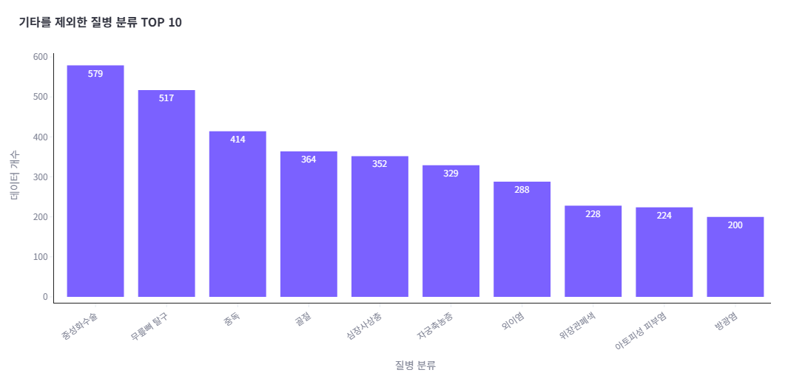
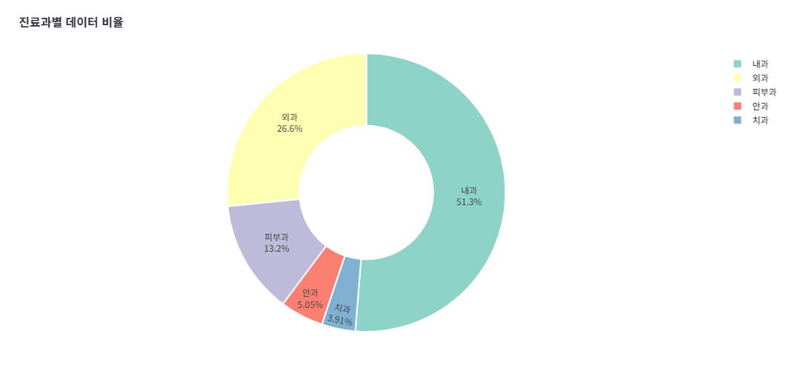
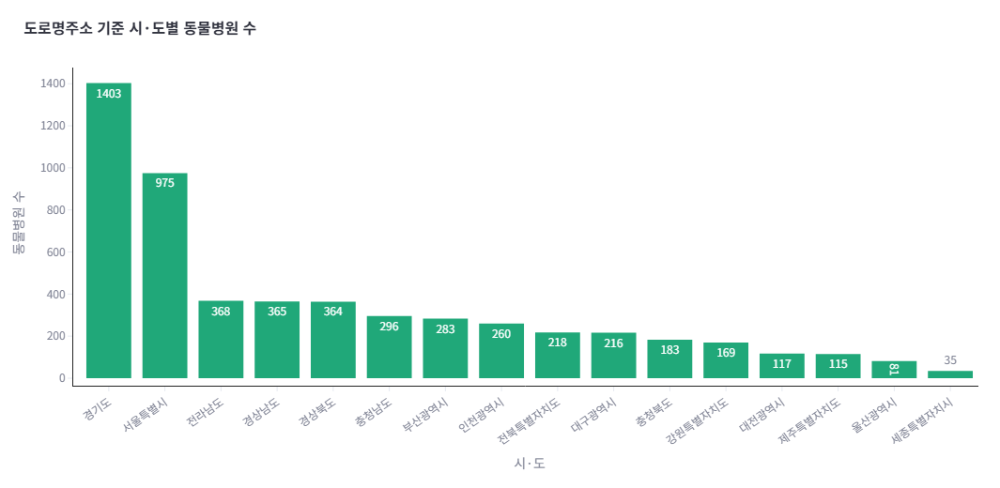

# 데이터 분석 





# RAG 답변 유사도 평가

## 요약

`data/chroma_db`의 `pet_care` 컬렉션을 사용해 RAG 답변 성능을 평가했습니다. 평가는 metadata 일치 여부보다, 질문을 넣었을 때 생성된 답변이 validation 정답 답변(`qa.output`)과 의미적으로 얼마나 가까운지를 중심으로 봅니다.

실행 결과, 50개 샘플 기준 생성 답변 평균 유사도는 `0.7448`이고, 검색된 근거 답변 자체의 평균 유사도는 `0.7721`입니다. 검색 근거가 가진 정보가 생성 단계에서 일부 약해지는 케이스가 있어, 검색 개선과 함께 프롬프트/답변 생성 방식 개선도 필요합니다.

## 실행 조건

| 항목 | 값 |
| --- | --- |
| 평가 노트북 | `notebooks/rag_retrieval_evaluation.ipynb` |
| validation 파일 | `data/df_val.csv` |
| Chroma DB | `data/chroma_db` |
| Chroma 컬렉션 | `pet_care` |
| Chroma 문서 수 | 19,206 |
| metadata 조합 수 | 247 |
| 전체 validation row | 560 |
| 평가 row | 50 |
| OpenAI 키 로드 | True |
| `ANSWER_TOP_K` | 3 |
| `K_VALUES` | `[1, 3, 5]` |

기본 설정은 비용과 실행 시간을 줄이기 위해 50개만 평가합니다. 전체 평가를 하려면 노트북에서 아래 값을 바꾸면 됩니다.

```python
EVAL_LIMIT = None
```

`기타` 질병을 제외한 데이터로 평가하려면 아래 경로를 사용합니다.

```python
VAL_PATH = PROJECT_DIR / "data" / "df_val_without_etc.csv"
```

## 평가 방식

1. `qa.input` 질문을 Chroma `pet_care` 컬렉션에 검색합니다.
2. 검색된 top-k Q&A 근거를 프롬프트에 넣습니다.
3. RAG 답변을 생성합니다.
4. 생성 답변과 정답 답변(`qa.output`)을 같은 embedding 모델로 임베딩합니다.
5. 두 임베딩의 cosine similarity를 계산합니다.
6. 검색 품질 참고용으로 `precision@k`, `recall@k`, `mrr@k`, `hit@k`도 함께 계산합니다.

정답 metadata를 검색 필터로 넣지 않습니다. 정답 라벨을 필터로 넣으면 실제 사용자 상황보다 점수가 과대평가됩니다.

## 핵심 지표

### 답변 유사도

| 지표 | 의미 |
| --- | --- |
| `generated_answer_similarity` | RAG가 생성한 답변과 정답 답변의 cosine similarity |
| `retrieved_answer_similarity` | 검색된 근거 답변 중 정답 답변과 가장 유사한 값 |

`retrieved_answer_similarity`가 높고 `generated_answer_similarity`가 낮으면, 검색은 비교적 잘 되었지만 생성 단계에서 정보가 약해졌을 가능성이 있습니다.

### 검색 참고 지표

검색 지표에서 relevant 기준은 아래 metadata 3개가 모두 일치하는 경우입니다.

```text
meta.lifeCycle
meta.department
meta.disease
```

| 지표 | 계산 방식 |
| --- | --- |
| `precision@k` | top-k 안의 relevant 문서 수 / k |
| `recall@k` | top-k 안의 relevant 문서 수 / 전체 relevant 문서 수 |
| `mrr@k` | top-k 안 첫 relevant 문서 순위의 역수 |
| `hit@k` | top-k 안에 relevant 문서가 있으면 1, 없으면 0 |

## 실행 결과

### 답변 유사도

| metric | count | mean | median | min | max | >= 0.70 | >= 0.80 | >= 0.90 |
| --- | ---: | ---: | ---: | ---: | ---: | ---: | ---: | ---: |
| `generated_answer_similarity` | 50 | 0.7448 | 0.7547 | 0.4208 | 0.9085 | 0.70 | 0.34 | 0.02 |
| `retrieved_answer_similarity` | 50 | 0.7721 | 0.7865 | 0.5094 | 0.9629 | 0.80 | 0.42 | 0.08 |

핵심 해석:

- 생성 답변 평균 유사도는 `0.7448`입니다.
- 검색 근거 답변 평균 유사도는 `0.7721`로 생성 답변보다 높습니다.
- 생성 답변 중 유사도 `0.80` 이상은 34%, `0.90` 이상은 2%입니다.
- 일부 케이스에서는 검색된 근거가 괜찮아도 생성 답변이 정답과 멀어집니다.

### 검색 참고 지표

| k | precision | recall | mrr | hit_rate |
| ---: | ---: | ---: | ---: | ---: |
| 1 | 0.0400 | 0.0055 | 0.0400 | 0.04 |
| 3 | 0.0733 | 0.0079 | 0.1067 | 0.20 |
| 5 | 0.0680 | 0.0090 | 0.1157 | 0.24 |

metadata 완전 일치 기준의 검색 점수는 낮습니다. 하지만 답변 유사도는 평균 0.7 이상이므로, metadata가 완전히 일치하지 않아도 의미적으로 가까운 답변을 가져오는 경우가 있습니다. 따라서 현재 평가는 metadata hit보다 답변 유사도를 중심으로 보는 것이 더 적절합니다.

### 질병별 답변 유사도

| gold_disease | count | retrieved_answer_similarity | hit_at_3 | generated_answer_similarity |
| --- | ---: | ---: | ---: | ---: |
| 중성화수술 | 1 | 0.6948 | 0.000 | 0.7003 |
| 방광결석 | 2 | 0.7260 | 0.000 | 0.7391 |
| 부신피질기능항진증 | 2 | 0.7350 | 0.500 | 0.7172 |
| 방광염 | 5 | 0.7416 | 0.400 | 0.7297 |
| 심장사상충 | 16 | 0.7532 | 0.125 | 0.7374 |
| 중독 | 16 | 0.7952 | 0.250 | 0.7695 |
| 위장관폐색 | 4 | 0.8050 | 0.000 | 0.7793 |
| 무릎뼈 탈구 | 2 | 0.8167 | 0.000 | 0.6526 |
| 단두종증후군 | 1 | 0.8209 | 1.000 | 0.7609 |
| 결막염 | 1 | 0.8312 | 0.000 | 0.6853 |

샘플 수가 적은 질병은 해석에 주의해야 합니다. 예를 들어 `중성화수술`, `단두종증후군`, `결막염`은 count가 1입니다.

### 낮은 생성 유사도 케이스

| row_index | generated_answer_similarity | retrieved_answer_similarity | gold_lifeCycle | gold_department | gold_disease | top1_lifeCycle | top1_department | top1_disease |
| ---: | ---: | ---: | --- | --- | --- | --- | --- | --- |
| 17 | 0.421 | 0.799 | 노령견 | 내과 | 심장사상충 | 자견 | 내과 | 기타 |
| 33 | 0.435 | 0.509 | 성견 | 내과 | 심장사상충 | 성견 | 피부과 | 기타 |
| 44 | 0.549 | 0.554 | 노령견 | 내과 | 심장사상충 | 성견 | 내과 | 심장사상충 |
| 21 | 0.582 | 0.748 | 노령견 | 내과 | 중독 | 성견 | 내과 | 기타 |
| 31 | 0.630 | 0.763 | 노령견 | 내과 | 방광염 | 자견 | 내과 | 기타 |

row 17은 `retrieved_answer_similarity`가 `0.799`인데 `generated_answer_similarity`는 `0.421`입니다. 이 유형은 검색보다 생성 프롬프트, 답변 압축, 근거 반영 방식 개선 대상입니다.

또한 낮은 유사도 케이스에서 top1 disease가 `기타`로 잡히는 경우가 많습니다. `기타` 라벨이 검색 품질 분석을 흐릴 수 있으므로 `df_val_without_etc.csv` 기준 평가도 함께 보는 것이 좋습니다.

## 결과 파일

노트북 실행 결과는 `notebooks/outputs` 아래에 저장됩니다.

| 파일 | 설명 |
| --- | --- |
| `rag_answer_similarity_eval_results.csv` | 질문별 상세 평가 결과 |
| `rag_answer_similarity_eval_summary.csv` | 답변 유사도 요약 |
| `rag_retrieval_reference_summary.csv` | 검색 참고 지표 요약 |
| `rag_answer_similarity_by_disease.csv` | 질병별 답변 유사도 요약 |

## 개선 방향

### 생성 단계 개선

- 프롬프트에 “검색 근거 밖 내용 금지” 조건 강화
- 답변 형식을 고정해 정답과 비교 가능한 구조로 생성
- 검색 근거 수(`ANSWER_TOP_K`) 조정
- 불필요하게 일반적인 문장보다 근거 답변의 핵심 정보를 더 직접 반영하도록 프롬프트 수정

### 검색 단계 개선

- embedding 모델 비교 실험
- chunking 방식 개선
- 질병명/증상명 정규화
- 자동 metadata 필터링 개선
- `기타` 라벨 제외 데이터셋으로 별도 평가

## 권장 다음 평가


1. 전체 데이터 평가를 위해 `EVAL_LIMIT = None`으로 변경합니다.
2. `retrieved_answer_similarity`는 높고 `generated_answer_similarity`는 낮은 케이스를 따로 분석합니다.
3. 프롬프트를 수정한 뒤 동일 지표로 재평가합니다.
4. 최종적으로 답변 유사도 외에 LLM judge 기반 환각 여부 평가를 추가합니다.
